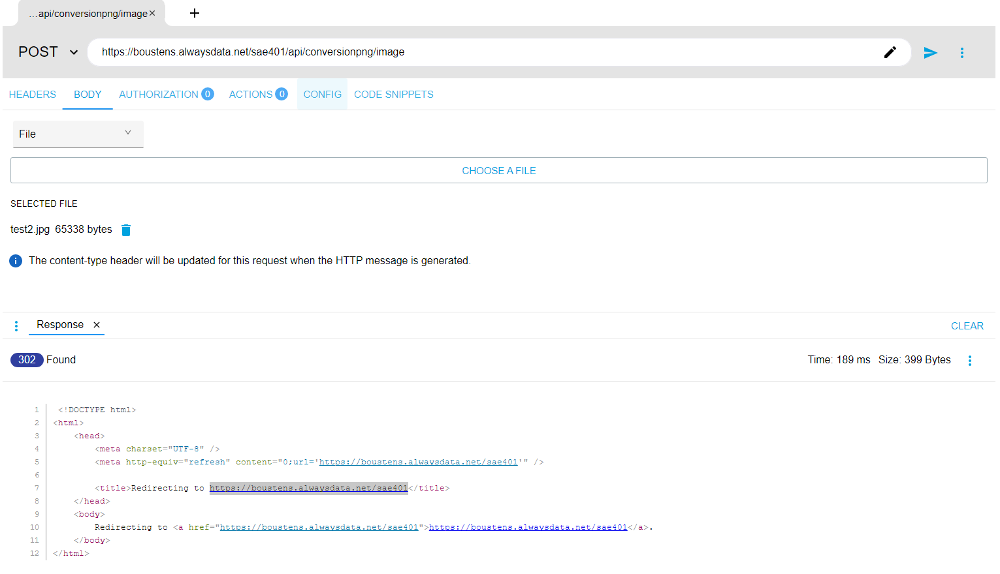

# Description du problème

Je suis en train d'essayer d'implémenter dans l'API, la conversion d'image. Cependant, en voulant tester la route sur ARC pour une conversion en png, celui-ci me renvoie un code 302 Found qui redirige vers le dossier public (https://boustens.alwaysdata.net/sae401) alors que je voudrais qu'il me renvoie soit un message d'erreur soit le message image convertie avec succès. Voir image ci-dessous. 

Ayant passé la matinée à chercher et n'y arrivant toujours pas, je fais appel à vous.
J'utilise Intervention Image v3 pour pouvoir convertir l'image. Je vous mets donc à disposition les fichiers que j'ai utilisé à savoir le model, la route et le controller avec la fonction convertirImagePng. 
